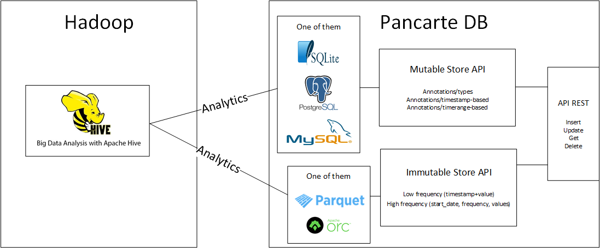

# Pancarte DB

## How it works

### What does it stores?

Immutable data:

* Raw waveforms (high frequency data, does not stores timestamps for each value, needs constant frequency data)
* Numerics (low frequency data, stores a value with a timestamp)
* Metadata such as source_id, type_id...

Mutable data:

* Annotation types
* Timestamp-based annotations
* Timerange-based annotations


### What can it do?

Writes:

* [x] Write waveforms, numerics
* [x] Write annotations

Read (you can combine these options):

* [x] Get data from date A to date B
* [ ] Get data where record_length >= 2hours
* [x] Get data where bed_id=X, signal_type=ECG
* [ ] Get data where there are arythmia annotations


### How does it stores data?

There are two types of data:

* Immutable: waveforms and numerics
* Editable/Expandable: metadata and annotations

Immutable data is directly stored in files that are not supposed to be editable.
Editable/Expandable data is stored in an easily queryable store (sqlite).



## Running it

```
python3 api.py hostname port
```


## Using it

### Annotations types:

An annotation type might be like 'bradycardia arrhythmia', 'start of record', 'end of record', 'heart R peak' or whatever you'd like

```
* GET <api-url>/annotations/types
-> returns all the annotations types

* GET <api-url>/annotations/types/<id>
-> returns the annotation type where id=<id>

* POST <api-url>/annotations/types (parameters=name:string)
-> returns the created annotation type with http code 201

* PUT <api-url>/annotations/types/<id> (parameters=name:string)
-> updates the annotation type where id=<id> and returns it

* DELETE <api-url>/annotations/types/<id>
-> deletes the annotation type where id=<id> and returns http code 204
```

### Timestamp-based Annotations:

```
* GET <api-url>/annotations/timestamp
-> returns all the annotations that are timestamp-based

* GET <api-url>/annotations/timestamp/<id>
-> returns the annotation where id=<id>

* POST <api-url>/annotations/timestamp (parameters=source_id:int, type_id:int, value:float, comment:string, timestamp_micros:int) 
-> returns the created annotation with http code 201

* PUT <api-url>/annotations/timestamp/<id> (parameters=source_id:int, type_id:int, value:float, comment:string, timestamp_micros:int)
-> updates the annotation where id=<id> and returns it

* DELETE <api-url>/annotations/timestamp/<id>
-> deletes the annotation where id=<id> and returns http code 204
```

### Timerange-based Annotations:

```
* GET <api-url>/annotations/timerange
-> returns all the annotations that are timerange-based

* GET <api-url>/annotations/timerange/<id>
-> returns the annotation where id=<id>

* POST <api-url>/annotations/timerange (parameters=source_id:int, type_id:int, values:float, comment:string, start_micros:int, end_micros:int)
-> returns the created annotation with http code 201

* PUT <api-url>/annotations/timerange/<id> (parameters=source_id:int, type_id:int, values:float, comment:string, start_micros:int, end_micros:int) 
-> updates the annotation where id=<id> and returns it

* DELETE <api-url>/annotations/timerange/<id>
-> deletes the annotation where id=<id> and returns http code 204
```

### Waveforms

```
* GET <api-url>/waveforms?lf=False&hf=True&start_micros=1525349279579912&end_micros=1525349290101982&source_id=7&type_id=2
-> returns all the high frequency (hf) data between 1525349279579912 and 1525349290101982 that has source_id=7 and type_id=2

* GET <api-url>/waveforms (parameters=lf_source_id:int, lf_type_id:int, lf_value:float, lf_timestamp_micros:int)
-> returns the created low frequency waveform with http code 201

* GET <api-url>/waveforms (parameters=hf_source_id:int, hf_type_id:int, hf_frequency:float, hf_start_micros:int, hf_values:list<float>)
-> returns the created high frequency waveform with http code 201
```